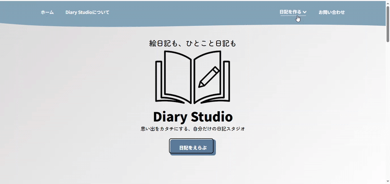

# Diary Studio



## 概要
絵日記とひとこと日記の二種類の日記をブラウザ上で作成できるWebアプリケーションです。ユーザーは、写真や地図を活用しながら、思い出や日々の出来事を残すことができます。

### サイトURL
https://a126kne.stars.ne.jp/diarystudio/
---

## 目次
1. [主な機能](#主な機能)
2. [使用技術](#使用技術)
3. [セットアップ方法](#セットアップ方法)
4. [使い方](#使い方)
5. [注意事項](#注意事項)

---

## 主な機能
### 絵日記作成（`picturediary.html`）

- 好きな画像を使って絵日記風の日記を作成
- 背景・テキスト・文字の色・フォントなどのスタイル変更
- スタイルリセット機能
- 日付・スタンプの追加
- 作成した絵日記をPNG形式で保存
### ひとこと日記作成（`tweetdiary.html`）

- OpenStreetMapを使った地図上での位置選択
- 日付・画像と100文字以内のコメントで日記作成
- 地図上にピンと吹き出しを表示
- LocalStorageに最大8件の日記を保存
- ピン・日記の相互ハイライト機能
- 日記の個別削除・全削除機能

---

## 使用技術
- HTML / CSS / JavaScript
- [Leaflet.js](https://leafletjs.com/) - 地図表示
- [OpenStreetMap](https://www.openstreetmap.org/) - 地図データ
- LocalStorage - データ保存

---

## セットアップ方法
### 1. このリポジトリをクローンまたはダウンロード

```bash
git clone https://github.com/itooogacha126-svg/DiaryStudio.git
cd DiaryStudio
```
### 2. ブラウザで開く
- サーバーのセットアップは不要です
- `index.html`をブラウザで開くだけで動作します

### 3. 動作確認
- **トップページ**: `index.html`
- **絵日記**: `picturediary.html`
- **ひとこと日記**: `tweetdiary.html`

各ページをブラウザで開いて機能を確認してください。

---

## 使い方

### 絵日記の作成
1. `picturediary.html`を開く
2. 画像をアップロード
3. テキストやスタイルを編集
4. 「保存」ボタンでPNG形式でダウンロード

### ひとこと日記の作成
1. `tweetdiary.html`を開く
2. 地図上で場所をクリック
3. 日付・コメント・写真（任意）を入力
4. 「保存」ボタンで登録

---

## 注意事項・補足
- このWebアプリケーションは学習・個人制作目的で作成されています
- データはブラウザのLocalStorageに保存されるため、ブラウザデータを削除すると日記データも削除されます
- トップページのお問い合わせフォームは見た目のみで、実際にメール送信はできません
- 地図データ取得のため、インターネット接続が必要です
